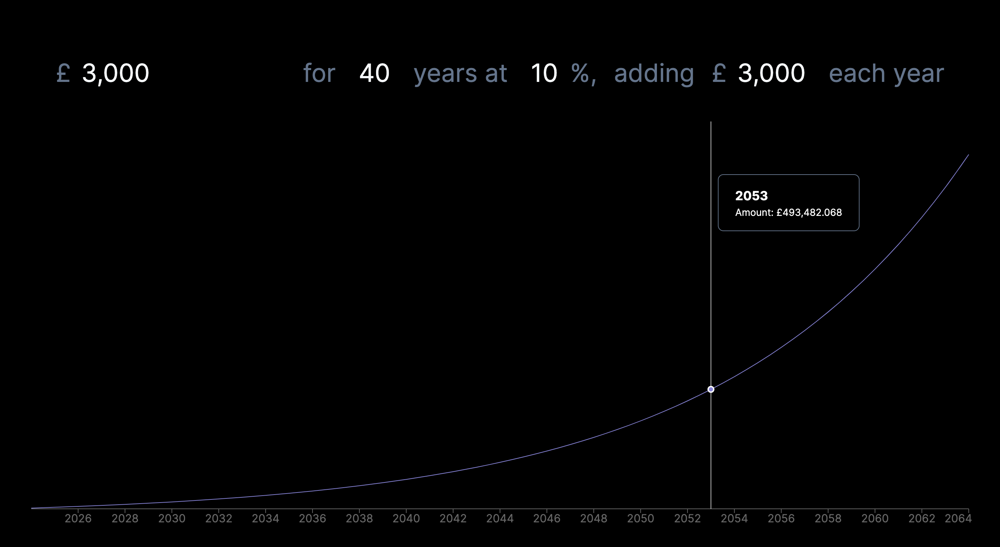
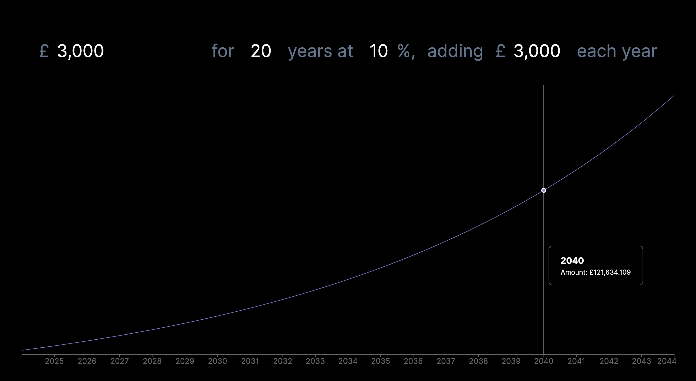
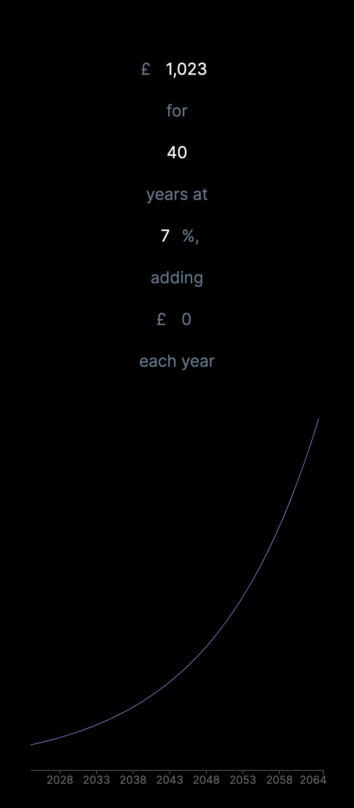

<center>
<h1>Compound Interest Calculator</h1>
<h3>Designed and Built by Martin Shaw in Manchester</h3>
Minimal, useful and powerful compound interest calculator which allows you to calculate the future value of your investment.
</center>

## Use it 
https://martinshaw.github.io/compound-interest-calculator/

## Screenshots







# For Developers:


## Getting Started

First, run the development server:

```bash
npm run dev
```

Open [http://localhost:3000](http://localhost:3000) with your browser to see the result.

## Deploy it to GitHub Pages

```bash
npm run deploy
```