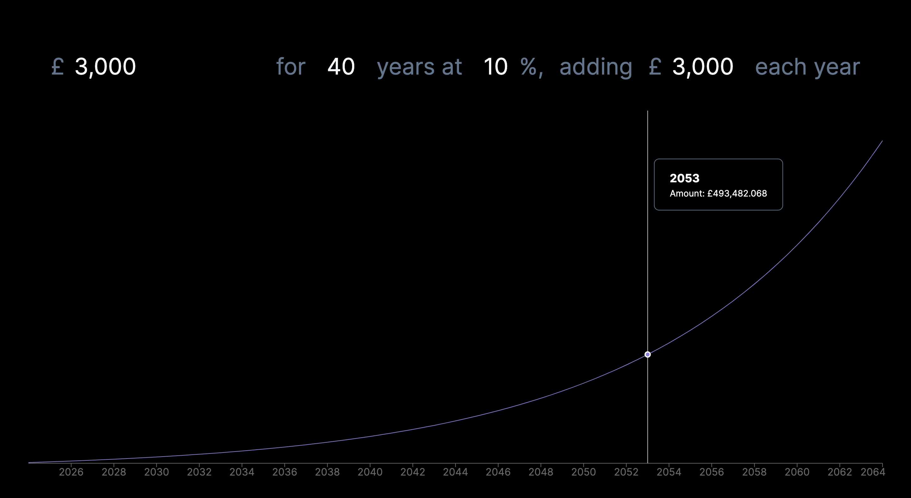
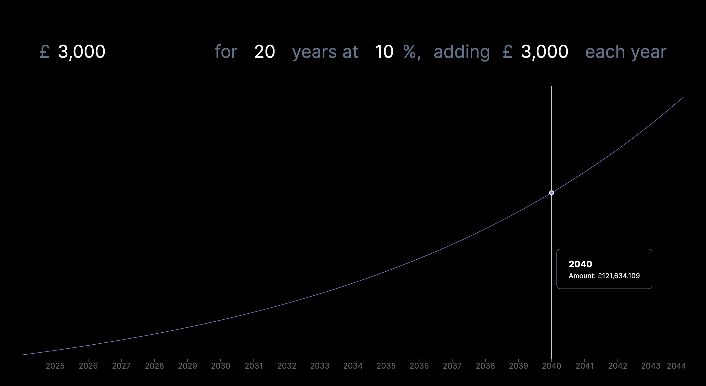

<center>
<h1>Compound Interest Calculator</h1>
<h3>Designed and Built by Martin Shaw in Manchester</h3>
Minimal, useful and powerful compound interest calculator which allows you to calculate the future value of your investment.
</center>

## Use it 
https://martinshaw.github.io/compound-interest-calculator/

## Screenshots





[Mobile Screenshot](screenshots/martinshaw.github.io_compound-interest-calculator_2.png)

# For Developers:


## Getting Started

First, run the development server:

```bash
npm run dev
```

Open [http://localhost:3000](http://localhost:3000) with your browser to see the result.

## Deploy to GitHub Pages

Deployment is automatic. Pushing to `master` runs the **Deploy to GitHub Pages** GitHub Action, which builds the static export and publishes it to the `gh-pages` branch (the branch GitHub Pages is already configured to serve).

You can also trigger a deploy manually from the Actions tab (**workflow_dispatch**).

```bash
npm test
npm run build
```

## Progressive Web App

The site ships a web app manifest and service worker. On supported mobile browsers (iOS Safari “Add to Home Screen”, Android Chrome “Install app”) it can run fullscreen like a native app, including a basic offline shell.