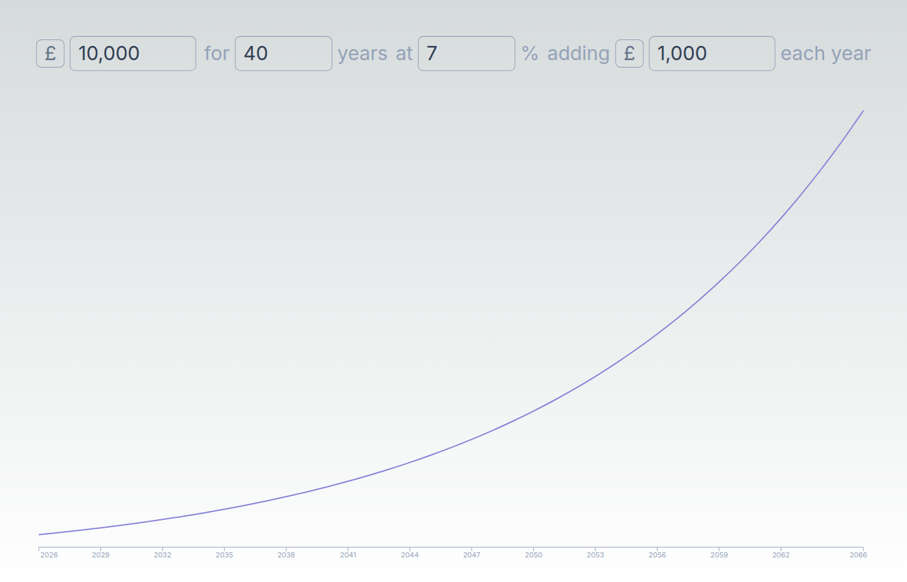
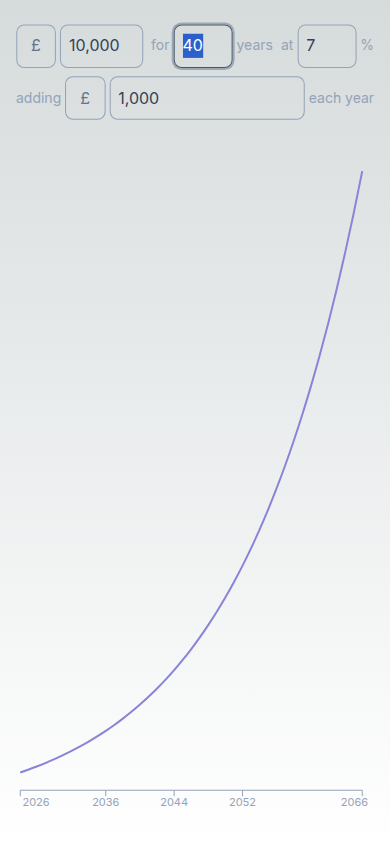
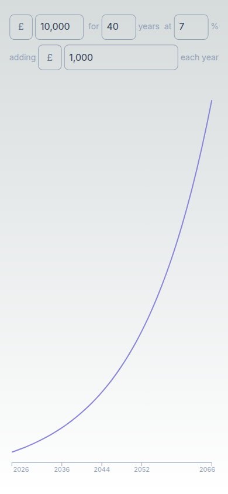

<center>
<h1>Compound Interest Calculator</h1>
<h3>Designed and Built by Martin Shaw in Manchester</h3>
Minimal, useful and powerful compound interest calculator which allows you to calculate the future value of your investment.
</center>

## Use it
https://martinshaw.github.io/compound-interest-calculator/

## Features

- **Compound growth chart** — ordinary annuity math for principal, annual rate, years, and yearly additions
- **Currency switcher** — tap (or right-click / long-press) the currency symbol to cycle £ $ € ¥ and more
- **Shareable URLs** — inputs sync to the query string, including currency, e.g.  
  `?amount=10000&years=40&rate=7&add=1000&currency=%C2%A3`
- **Progressive Web App** — installable on phone/desktop; works fullscreen like a native app
- **Full offline support** — after one online visit, the client-side app keeps working without a network (versioned service worker cache `compound-interest-vX.Y.Z`, currently `v2.0.0`)
- **Mobile-friendly controls** — unbreakable control phrases, visible input borders, accessible focus rings, and a layout that stays on one row across wide viewports and wraps cleanly on small screens
- **iOS install hint** — closable “Add to Home Screen” tip in Safari

## Screenshots







# For Developers

## Getting Started

First, run the development server:

```bash
npm run dev
```

Open [http://localhost:3000](http://localhost:3000) with your browser to see the result.

## Deploy to GitHub Pages

Deployment is automatic. Pushing to `master` runs the **Deploy to GitHub Pages** GitHub Action, which builds the static export and publishes it to the `gh-pages` branch (the branch GitHub Pages is already configured to serve).

You can also trigger a deploy manually from the Actions tab (**workflow_dispatch**).

```bash
npm test
npm run build
```

`prebuild` stamps `public/sw.js` with `compound-interest-v{package.version}`. After the Next export, `precache-sw.js` injects hashed `/_next/static` assets into `dist/sw.js` so the whole app shell can be cached for offline use.

## Progressive Web App

The site ships a web app manifest and service worker. On supported mobile browsers (iOS Safari “Add to Home Screen”, Android Chrome “Install app”) it can run fullscreen like a native app.

**Offline:** yes — the calculator is entirely client-side. After you’ve opened it online once, the service worker caches the app shell and static assets so it keeps working without a network. Each release busts the cache (`compound-interest-vX.Y.Z`). An `offline.html` fallback is shown only if the app shell is not yet cached.
